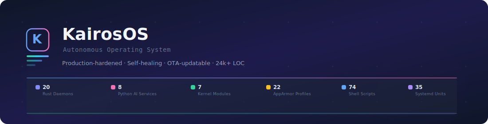
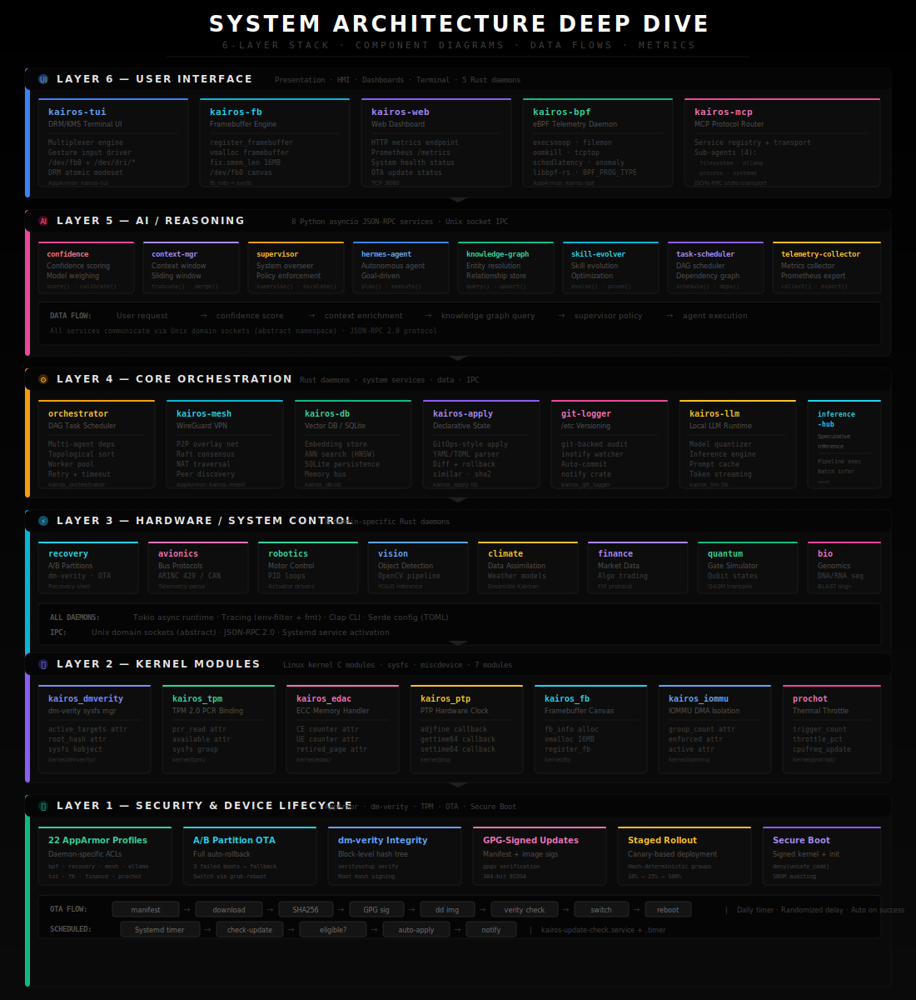
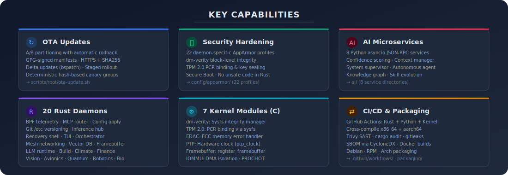

KairosOS is a **production-hardened autonomous operating system** with 20 Rust daemons, 8 Python AI microservices, 7 C kernel modules, 74 shell scripts, 35 systemd units, and 22 AppArmor profiles — **580+ source files, 24,000+ lines of code.**

[](LICENSE)
[](https://github.com/sudish80/KairosOS/actions/workflows/ci.yml)
[](https://www.rust-lang.org)
[](https://python.org)
[](https://kernel.org)

---

## Quick Start

```bash
git clone https://github.com/sudish80/KairosOS.git && cd KairosOS

# Build everything
make rust-build   # 20 Rust daemons
make kernel-build # 7 kernel modules
make test         # run all tests

# Install & enable
sudo make install
sudo systemctl enable --now kairos-bpf kairos-mcp kairos-apply
sudo systemctl enable --now kairos-recovery kairos-git-logger
sudo systemctl enable --now kairos-update-check.timer
```

---

## Architecture



---

## Capabilities



---

## OTA Updates

KairosOS has a full over-the-air update system with A/B partitions, GPG-signed manifests, SHA256 verification, delta updates via bspatch, and deterministic staged rollouts.

```bash
sudo ota-update.sh check       # check for updates
sudo ota-update.sh apply       # apply & reboot
sudo ota-update.sh rollback    # revert if needed
```

## Security

- **22 AppArmor profiles** — daemon-specific least-privilege
- **dm-verity** — block-level integrity verification
- **TPM 2.0** — PCR binding and key sealing
- **Secure Boot** — signed initramfs and kernel modules
- **No unsafe code** — `#![deny(unsafe_code)]` in all Rust

## Testing & Verification

```bash
sudo scripts/root/verify-build.sh        # full build verification
cd src && cargo test --workspace         # Rust tests
python3 -m pytest tests/ ai/*/tests/ -v  # Python tests
for d in kernel/*/; do make -C "$d"; done # kernel module build check
```

## Packaging

```bash
make deb   # Debian/Ubuntu .deb
make rpm   # Fedora/RHEL .rpm
make arch  # Arch Linux package
make build-iso CONFIG=kairosos_defconfig  # bootable ISO
```

## Documentation

| Document | Description |
|----------|-------------|
| [Production Deployment](docs/production-deployment.md) | Full deployment guide |
| [OTA API Spec](docs/ota-server-api.md) | Update server API v1 |
| [CHECKLIST](CHECKLIST.md) | Complete feature status (1500 items) |

## Contributing

See [CONTRIBUTING.md](CONTRIBUTING.md) for guidelines.

## License

GNU General Public License v2.0 — see [LICENSE](LICENSE) for details.
